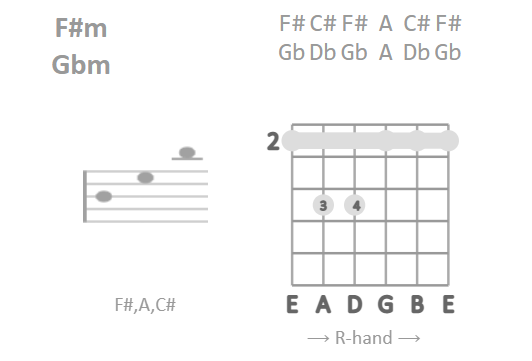
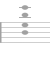
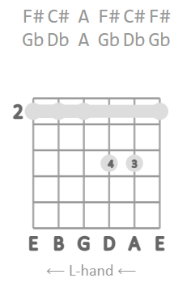

# Guitar-Chords overview
### This piece of work is for all guitar-players and learners.
Music makes the world to a better place. All people should be enabled to play music. Everybody is invited to improve oneself, so this is free (MIT license).
Use it, grab it, share it, improve it!

[Try out live example](https://ivosdc.github.io/guitar-chords/dist "Guitar tuner Example")
and / or include into your website.
 `npm i guitar-chords-viewer`

### A simple collection of all main-chords for guitarists. You can see chords...
- as notes on a scale
- as tab on a sterilized guitar neck.



- Stacked or spread chord-notes: 
 



### Left-handed view
You can also change/mirror the view of the guitar-neck. Normally the views are made for right-handed guitars.
Changing the view might be more easy for left-handed learners to transport the image to the guitar neck.

- L/R view for left-handed users.
- notes, fingerings, strings, tuning are mirrored.




# Technical
### Chord-viewer for https://api.uberchord.com chords. E.g. "C":
```
{
  strings: 'X 3 5 5 4 3',
  fingering: 'X 1 3 4 2 1',
  chordName: 'C,m,,',
  enharmonicChordName: 'C,m,,',
  voicingID: '9223372036959802495',
  tones: 'C,Eb,G'
}
```

By now there is a set of the main-chords build in.
This JSON generates all aspects of the guitar-chords-viewer. Use the parameter `chord`to inject a chord.
```js
export let chord = {
 strings: 'X 3 5 5 4 3',
 fingering: 'X 1 3 4 2 1',
 chordName: 'C,m,,',
 enharmonicChordName: 'C,m,,',
 voicingID: '9223372036959802495',
 tones: 'C,Eb,G'
}

<GuitarChords {chord} />
```


### Made with Svelte. <guitar-chords></guitar-chords>

Usage as:
- Web-component: `<guitar-chords></guitar-chords>`

```html
<head>
    ...
    <script defer src='https://ivosdc.github.io/guitar-chords/dist/build/guitar-chords.js'></script>
</head>
<body>
<guitar-chords></guitar-chords>
```

- or as svelte-component `<GuitarChords />`

```js
<script>
import GuitarChords from 'guitar-chords-viewer/src/GuitarChords.svelte';
</script>

<GuitarChords />
```
